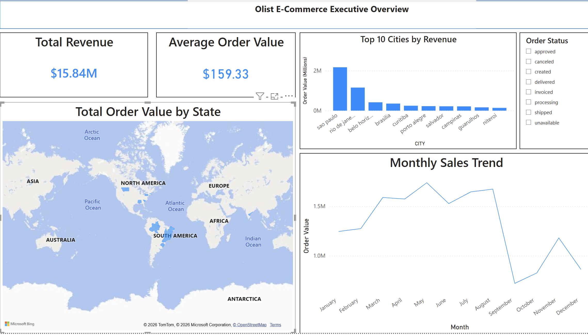

# Olist Ecommerce Analytics Pipeline
An end-to-end ELT pipeline built with **dbt**, **Snowflake**, and **GitHub**.

## Project Overview
This project demonstrates an end-to-end Data Engineering and Analytics pipeline using the Olist Brazilian E-Commerce dataset. I built a full ELT (Extract, Load, Transform) workflow that moves raw data into a cloud warehouse, transforms it into business-ready dimensions and facts using dbt, and visualizes key performance indicators in Power BI

## Architecture
This project follows a Medallion Architecture (Bronze/Silver/Gold) approach to ensure data quality and modularity:

- **Staging Layer (Silver):** Created modular staging views, including stg_olist_orders and stg_olist_customers, to perform initial cleaning, handle data type casting, and rename columns for better readability.
-**Intermediate Logic:** Developed the stg_items model to aggregate raw order line items. This model calculates key metrics like Total Item Revenue and Total Shipping Cost at the order_id level to prepare for high-level fact building.
- **Marts Layer (Gold):** Developed the final fct_orders fact table within the MART schema. This table represents the "Single Source of Truth," created by joining three distinct data streams—Orders, Customers, and the aggregated Items data—enabling seamless analysis in Power BI..

## Tools Used
- **Snowflake:** Data Warehouse & Compute.
- **dbt (Data Build Tool):** Modeling and Transformation.
- **GitHub:** Version control and CI/CD.
- **Environment:** Python Virtual Environments & VS Code.
- **Connectivity:** Snowflake connected to Power BI via Import Mode.

## Business Insights & Results
After transforming the raw data in **Snowflake** using **dbt**, I built an executive dashboard in **Power BI** that revealed:
* **Total Revenue:** $15.84M
* **Average Order Value (AOV):** $159.33
* **Regional Insight:** São Paulo (SP) is the highest volume region but has a lower AOV ($139.65) than the national average, indicating a high-frequency, lower-spend market.

## Technical Challenges & Troubleshooting
Building this pipeline required navigating several real-world technical hurdles:

**State Management & File Saving:** Encountered dbt "Compilation Errors" where changes in the code were not reflecting in the terminal. I identified that VS Code had not committed the file changes to disk (indicated by the "white circle" on the tab), emphasizing the importance of save-state management in local development.

**Dependency Resolution:** Solved a dbt node reference error where fct_orders depended on an undefined model. I resolved this by building out the missing stg_items staging layer and correctly using the ref() function to ensure a clean DAG (Directed Acyclic Graph).

**BI Security Configurations:** Faced an "Access Denied" error in Power BI when trying to render geographic maps. I successfully troubleshot this by enabling map visuals in the global security settings and categorizing the STATE field to ensure Bing Maps recognized the Brazilian regional codes.

**Cross-Platform Integration:** Managed a complex environment running Snowflake and dbt on macOS while simultaneously hosting Power BI Desktop via a Parallels Windows VM, ensuring stable connectivity between the two operating systems.