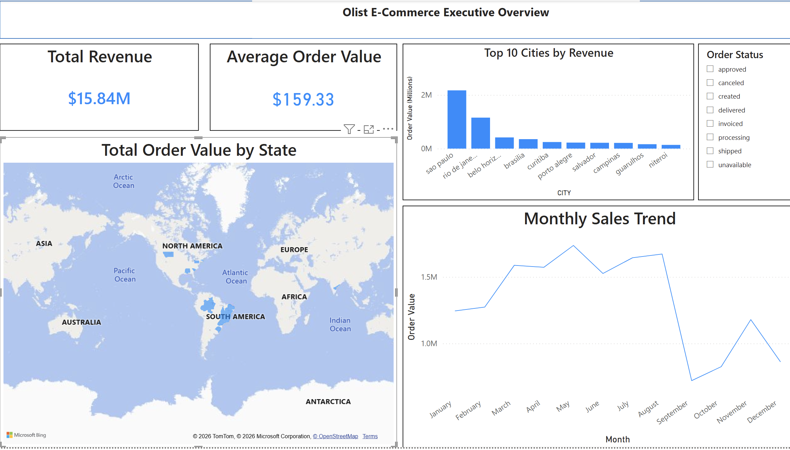

# Olist E-Commerce Analytics Engineering Pipeline

Production-style ELT pipeline built with **dbt**, **Snowflake**, and **Power BI** using the Olist Brazilian E-Commerce dataset.

---

## 🚀 Objective

Design and implement a modular analytics engineering workflow that:

- Loads raw transactional data into Snowflake
- Transforms data using dbt following Medallion architecture
- Implements automated data quality testing
- Produces business-ready fact tables
- Powers executive dashboards in Power BI

---

## 🏗 Architecture

This project follows a **Medallion Architecture (Bronze / Silver / Gold)** approach.

### 🥉 Bronze (RAW Layer)
- Raw Olist CSV files loaded into Snowflake
- No transformations applied
- Serves as immutable source-of-truth layer

### 🥈 Silver (STAGING Layer)
- Modular dbt staging models:
  - `stg_olist_orders`
  - `stg_olist_customers`
  - `stg_items`
- Data type casting
- Column renaming for readability
- Standardization of primary/foreign keys
- Order-level aggregation of:
  - Total Item Revenue
  - Total Shipping Cost

### 🥇 Gold (MART Layer)
- `fct_orders` fact table built in MART schema
- Star-schema design
- Joins:
  - Orders
  - Customers
  - Aggregated order items
- Acts as the **Single Source of Truth** for reporting

---

## ⭐ Data Model (Star Schema)

**Fact Table**
- `fct_orders`

**Dimensions**
- Customers
- Geography (State)
- Date (derived from order timestamp)

---

## 🛠 Technology Stack

- **Snowflake** – Cloud Data Warehouse
- **dbt (Data Build Tool)** – Data transformation & testing
- **GitHub** – Version control
- **Python 3.12 (Virtual Environment)** – Pipeline orchestration
- **Power BI** – Business Intelligence visualization
- **VS Code** – Development environment

---

## 🧪 Data Quality & Automation

### Automated Pipeline
Custom Python script:
